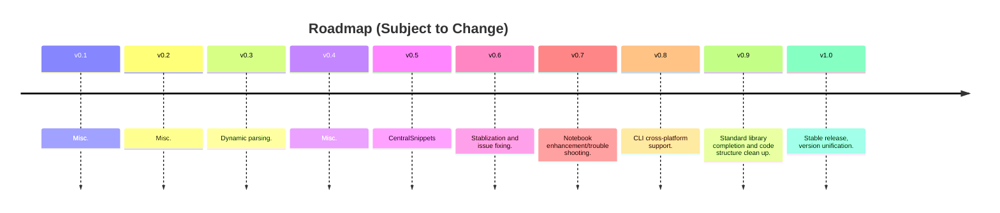
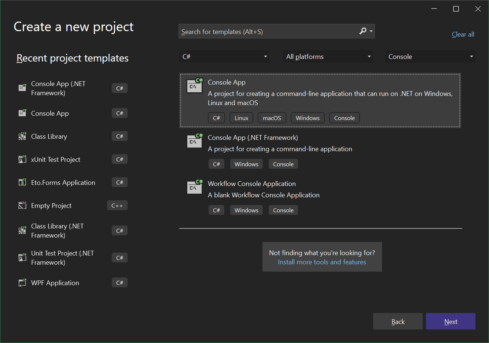
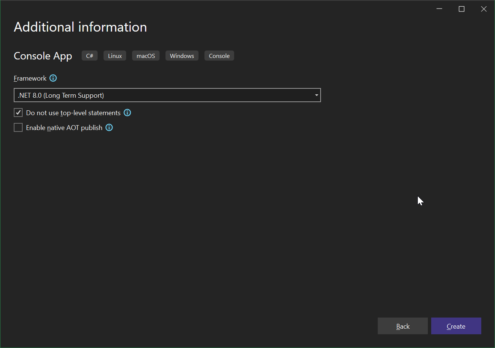
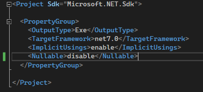
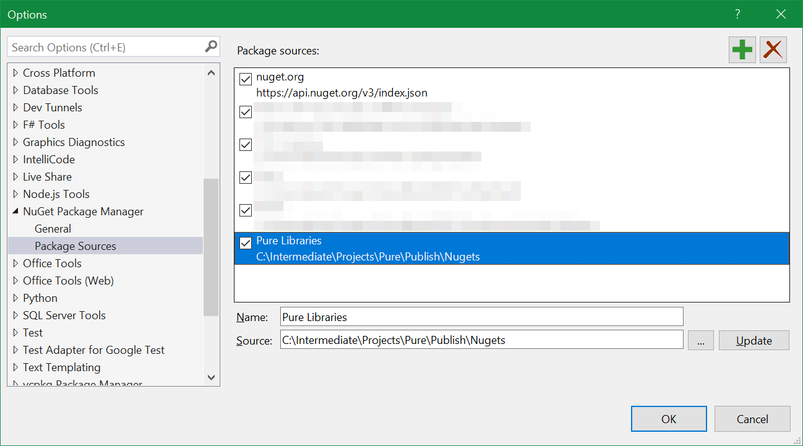
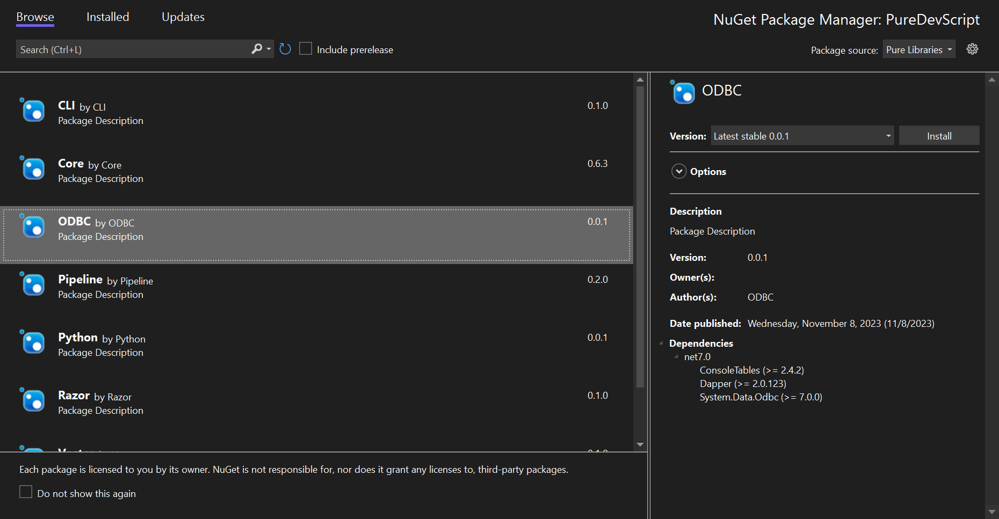
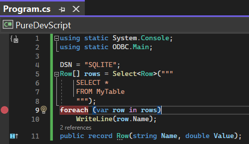

# Pure - Lightweight Native C# Scripting Environment for .Net 7

Pure is a lightweight scripting environment based on Roslyn, offering some standard libraries for quick common tasks, and provides a handy scripting (REPL and Notebook) interface.  
The Notebook interface is only usable for Window - but one can easily develop one for other desktop environments using cross-platform techniques. I didn't bother because I am the only one using Pure.

Pure is the scripting version of C# with:

1. Default global scope Math functions
2. Top level function and variable definitions, in addition to classes and all other common constructs of C#
3. Making simple and common things simpler
4. Macros to support text-based parsing, file inclusion and module import.

Features:

* Single-word package names.
* On-prompto package invokation (through `Import`).
* Pure uses `PUREPATH` to search for scripts when using `Include` and when executing script file directly from command line as the first argument.

I have highlighted the difference/advantage compared to traditional programming/scripting platforms:

|Platform|Pure|C#|Python|PowerShell|Perl|
|-|-|-|-|-|-|
|Installation Size|Required .Net 7 (ASP.Net) Runtime; Distributable is around 100Mb|Proper development with an IDE (Visual Studio or IntelliJ) takes forever to install.|Too many versions.|Super easy to install and use.|Super lightweight and fast.|
|Stability|C# .Net 7 based, will probably never change, very stable (depends on underlying C#); Very little new language constructs. Easily migratable to proper C#|Very stable as long as one doesn't bother GUI.|Fairly stable.|Fairly stable.|(PENDING)|
|Package Management/Functionalities|Zero-hassle package management and functionalities import; Single-file throughout.|Many button-clicks (in IDE) or commands or csproj file modification to install pckages. Self-contained dependancy environment; Fast and lightweight.|Package management is troublesome, messy distributable/end script environments.|Batteries packed and I think generally bad idea to import additional non-official functionalities.|(PENDING)|
|Summary|Provides most efficient short-snippet authoring capabilities.|Best for strongly typed and highly articulated solutions.|Lack of advanced language constructs; Ubiquitous support.|Good process automation; Syntax not suited for efficient OOP programming.|(PENIDNG)|

Some earlier experimental features are being deprecated:

1. Minimalist syntactic sugar for more friendly REPL usage (specifically, semi-colon usage)
2. Top-level import of static `Main` class from DLL libraries

Pure provides the following standard libraries for "making things easier":

|Library|Purpose|Status|
|-|-|-|
|ODBC|Database connection.|Stable|
|Python|Python interoperation.|Experimental|
|Pipeline|Shell-level task automation.|Experimental|
|Razor|Single-entry exposure of Razor template engine.|Experimental|
|CentralSnippets|Endpoint for [Central Snippets](https://centralsnippets.pure.totalimagine.com/) public sharing.|Experimental|

Certain macros/syntax are provided to implement language level scripting constructs:

|Macro/Syntax|Function|Remark|
|-|-|-|
|`Import()`|Import modules from PATH, and automatically download packages from NuGet|Must be on its own line|
|`Include()`|transclude scripts from file path|Must be on its own line|
|`Help(name)`|Get help about namespaces, types, and specific variables||
|Expresison evaluation|For single line assignment and variable creation, no need to append `;` at end of line - for script files, it must be properly formatted|Only applicable at REPL|



At the moment, the version of Pure suites shall be identified/associated with [Core version](https://github.com/search?q=repo%3APure-the-Language/Pure%20CoreVersion&type=code).

## Installation

The source code can be built on Windows/Linux with .Net 7 SDK.

* To use on Windows, just download prebuilt executables from [Release](./releases/latest).
* To build on Linux, either try `PublishAll.ps1` (require `pwsh`), or just do `otnet publish Frontends/Pure/Pure.csproj --use-current-runtime --output Publish`.

## Create a Library for Use in Pure

There are three types of ready-to-use libraries for Pure:

* Any regular C# Net 7 DLL, as published on [Nuget](https://www.nuget.org/).
* Any user-authored scripts that may be included using `Inlcude` macro.
* Any user-shared snippets published on [Central Snippets](https://github.com/Pure-the-Language/CentralSnippets) or similar places.

The intended usage scenario of Pure is like this:

* Pure provides a complete syntax and all of the standard features of .Net 7 runtime
* On top of the basics, Pure provides some standard libraries to further streamline common tasks
* On top of that, Pure provides native support for library importing (using `Import()`) and scripting importing (using `Include()`)
* When extending existing functionalities of Pure or simply developing libraries around re-usable code, a developer would write actual C# Class Library projects and expose those as DLLs for end consumption in Pure.

As such, to create a library for Pure is very easy - just like creating any standard C# library. A convention is used that a static class named `Main` inside the library assembly will have all its static members made available globally when using `Import()` in Pure.  
By default, when importing in Pure, all namespaces of the DLL module containing public classes will be imported.

**Troubleshooting**

Pure is written in Net 7. However, when loading external DLLs, it's currently only safe to assume only Net Standard 2.0 and maybe Net Core 3.1 contexts are supported (i.e. just loading Net 7 may not work out of the box). For instance, System.Data.Odbc will throw exception "Platform not Supported" even though the platform (e.g. win64) is supported - it's the runtime that's causing the issue. A temporary workaround is when developing plugin/libraries, all plugins should target Net Standard 2.0+ or Net Core 3.1+ or Net Framework 4.6.1+. In reality, the issue is NOT within Net 7 as hosting context - THE RUNTIME IS INDEED 7.0.1 (within Roslyn), and [CSharpREPL](https://github.com/waf/CSharpRepl) (our reference interpreter) can consume System.Data.Odbc without problem, so we should be able to load Net 7 assemblies, it's just due to the way we handle DLL loading, we need to load exactly the correct DLL and cannot load an "entry" dll. We use CSharpREPL to find the correct DLL that we need (e.g. for ODBC, it should be `AppData\Roaming\.csharprepl\packages\System.Data.Odbc.7.0.0\runtimes\win\lib\net7.0\System.Data.Odbc.dll`).

System.Drawing is not (directly) supported on this platform. Notice the scenario is like that when using ODBC libraries - likely because it has many runtime versions. This is because at the moment "Import" cannot properly make use of the likely-redirection dlls. One solution for this is to select specific runtime when build instead of target "Portable" runtime.

Library Authoring Requirements: Note that any (plug-in) libraries being authored CANNOT (and thus should not) directly target (or indirectly target) *.Net 7 Windows* because the hosting environment (aka. Pure) target *.Net 7* (without specifying windows as target). The solution for this is to isolate such components and trigger as sub-process (so some sort of data tranmission or IPC is needed).

## Visual Studio Development

For quick on-demand develpment, it's recommended to use [Notebook](./Frontends/Notebook/) for that purpose.

For slightly more involved scripts, one can use Visual Studio for debugging purpose. (For more advanced applications, it's recommended to use proper C#). Notice it's recommended to keep everything in single file and do not commit csproj and sln files to version control.

Create a C# Console project with .Net 7 while making sure *Do not use top level statements* is toggled off.




It's recommended to specify `<Nullable>disable</Nullable>` in `.csproj` file, as shown below:



To reference Pure libraries in this environment, you just need to setup Nuget source to point to the installation folder of Pure, which contains a folder of Nugets.



Afterwards, installing packages is just like with any other C# project.



After this setup, you are able to write and debug Pure scripts directly in Visual Studio:



Notice there are a few notable differences:

1. You will not be able to use `Import`, which automatically finds the library and sets the static `using`.
2. C# top level statements require type definitions (e.g. records) at the bottom of all other functions and statements, while in Pure you can do it anywhere.
3. You need to explicitly state `using static System.Console;` in order to expose those names to the file scope, while in Pure this is done automatically.

Here is the complete script:

```c#
// Notice `Import(PackageName)` macro is only available in Pure
Import(ODBC)
using static System.Console;
using static ODBC.Main;

DSN = "SQLITE";
Row[] rows = Select<Row>("""
    SELECT *
    FROM MyTable
    """);
foreach (var row in rows)
    WriteLine(row.Name);
public record Row(string Name, double Value);
```

When converting C# projects to Pure scripts, note the following differences:

```C#
// Import(ODBC)

using static System.Console;
using static ODBC.Main;

// Include(MyScript.cs)
string[] Arguments = new string[] { "--help" };
```

Where, 

1. `Import()` and `Include()` doesn't work, but one can use Nuget and project files to achieve the same effect.
2. `using` statements must be at the top of the script in both C# and Pure.
3. One needs to define an auxiliary `string[] Arguments` which is supplemented by Pure otherwise.

## TODO

(CONSIDER PUTTING THEM ALL INTO GITHUB ISSUES)

The current state of Pure is very OK to be used for one-liners and quick REPL commands. The two frontends (one REPL/CLI and the other Notebook) are generally very stable right now.

- [ ] The REPL interpreter (along with the core engine) aka. Pure.exe cannot parse statements that span multiple lines, this makes stuff like defining functions or classes very inconvinient if not at all impossible - this is not an issue when using Pure to execute script files, but is a hassle when using the REPL. The Pure.exe program itself apparently needs work, along with tne engine code - as a full re-write/replacement, we are yet to integrate BaseRepl from CSharpRepl and implement codename Aurora, though we must be careful to make sure the runtime and startup speed of Pure is acceptible, because at the moment the startup time of Pure is much slower than Python, Elixir or other cli programs. By all means, due to lack of development resources, we might not bother more advanced REPL because it's not worth it and Pure is very efficient without it for majority of use cases.
- [ ] Importing and consuming Nuget packages is functional but not fully streamlined/safe yet - at the moment it's stable if we consume individual packages, but there is no built-in mechanism to safe-guard against potential dependency issues.
- [ ] Currently `Help` is not showing extension methods.

- [ ] (Core)(Pipeline Library) Provide Utilities.Run that streamlines running command and gets output as string.
- [ ] (Data Library) Provide `Data` (standalone).
- [ ] (Core) Enhance "Arguments" with all kinds of command line argument utilities like Elixir and how we usually use it.

- [ ] (Documentation) Create basic usage YouTube demo
- [ ] (Documentation) Create standard library YouTube usage tutorial

# (Wiki) Pure - The Scripting Language

<!-- This will be the main book for Pure usage; Consider it as a user guide; This shall be written independent from the rest of Pure solution documentations. -->

As a scripting language, pure has the following features:

* It's strongly typed
* It requires a semi-colon to end a statement
* Its names are case sensitive

Who should use Pure:

* Programming Beginner
* C# Veterans
* Those looking for alternative to Python for automation.

Basic Usage: 

* Download [BaseRepl](https://github.com/Pure-the-Language/BaseRepl) to get familiar with CSharp syntax and REPL with C#.
* Play with Pure just like BaseRepl (Releases are generally available on [Github](https://github.com/Pure-the-Language/Pure/releases) or [Itch.io](https://charles-zhang.itch.io/pure)).

## Chapter 1 - Basics

### Declare Variables

You can declare variables using keyworf `var`. Variables must be declared and initialized before it can be used. There is no need for semicolons when declare variables.

```C#
var a = 5 // Good
b = 7 // Bad: b is not defined
```

### Import Libraries

Use `Import(<Library Name>)` to import libraries. Libraries should be available under PATH as .Net 7 (or .Net Standard) DLL files.

A library is a collection of C# functionalities. ~~It can optionally expose a static Main class, the methods of which will become available at global scope upon import~~ (deprecating, consider using `using static` explicitly instead).

### 1D Vectot Numerics

Pure supports simple vector numerics through a library. See Vector library for more details. Below is some basic example:

```c#
// Define vectors using values or strings
var a = Vector(1, 2, 3)
var b = Vector("2 3 4")

// Vectors support arithmetics using operators
a + b
a * 5
```

## Chapter 2 - REPL

As a scripting language, REPL and scripts are two primary use of Pure. REPL refers to read–eval–print loop, it's done by interactively executing Pure expressions with the interpreter terminal Pure.

### Get Information (NOT IMPLEMENTED)

At any time during REPL (read–eval–print loop), use `Help(<name>)` to get information on variables, types, namespaces, and libraries.

### Save Session

After you've done some REPL exercise, you can output you inputs in this session by using the `Save(<File Path>)` command. After it's saved, you can modify and clean up the saved history of commands for proper script re-use.

## Chapter 3 - Standard Libraries

A few standard libraries are provided as light wrappers of some conventional functionalities as encountered per author's experience and work needs.

### ODBC

```c#
DSN = "Some DSN";
// Create a type to use as return result
public record Result(string Name, double Value);
Select<Result>("""
SELECT
    Name,
    Value
FROM MyValues
"""); // Returns an array
```

## Chapter N - Proper Usage Tipcs -> Best Practice

Pure is designed for quick one-shot scripts that are short and functional. As a rule of thumb, it's intended for things that do not exceed a few hundred lines - assuming proper code management is already implemented.

As scripts grows and code is refactored for proper management, one might use `Include` for simple code management; But as code grows in complexity, either one of the two must be done for more reasonable code management:

1. Refactor shared code into proper C# DLL as library;
2. Refactor code project into a proper standalone C# solution.

New: "Develop in Visual Studio, Run in Pure" methodology. For easier debugging and styling for beginners.