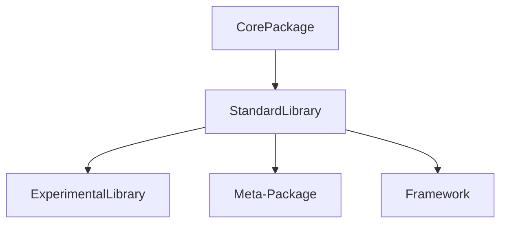

# Standard Libraries

Lean wrappers and thin dependencies, scripting-oriented. Moving forward we generally do not wish to implement a `Main` in new libraries and rely on meta-packages to expose/import interfaces.

* Standard Library: Base class for all libraries to inherit from.
* Experimental Library: Semantical emphasis on the experimental status of the library.
* Meta-Package: Meta-packages are implemented as proper C# dlls but can have instructions that's running on scripting scope.
* Frameworks: Intended for complete problem-solving solutions as is.